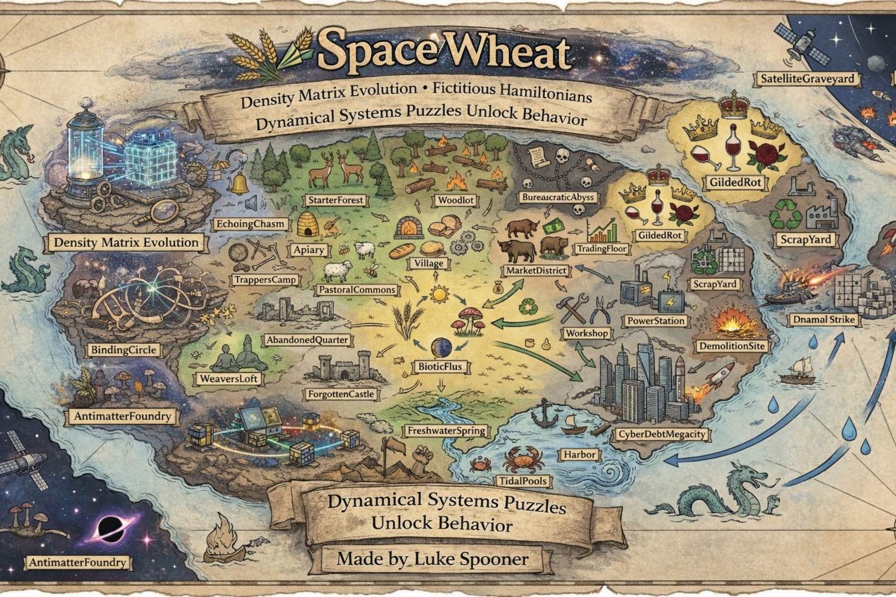
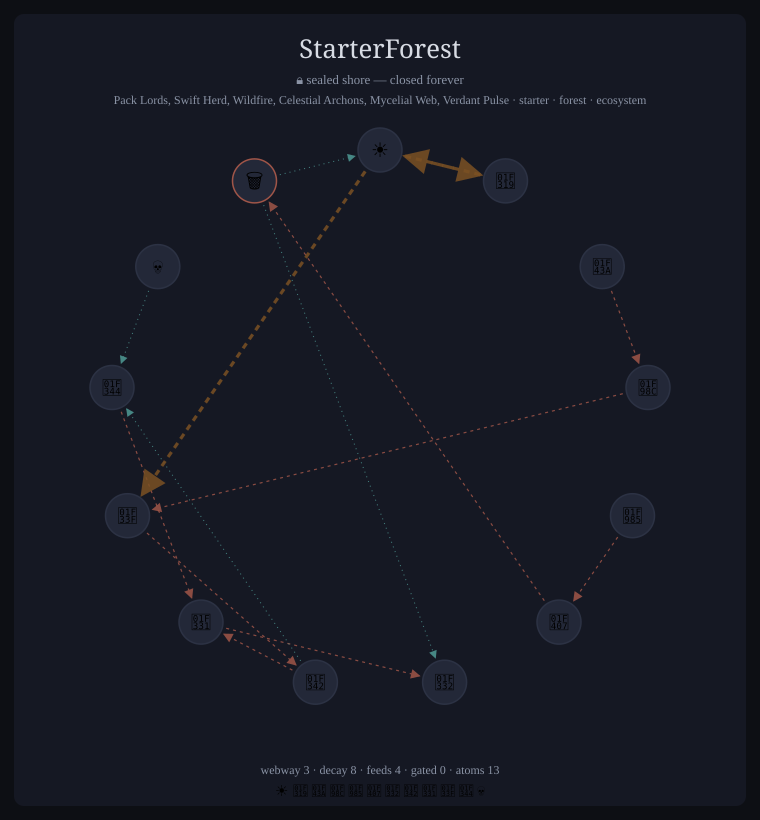
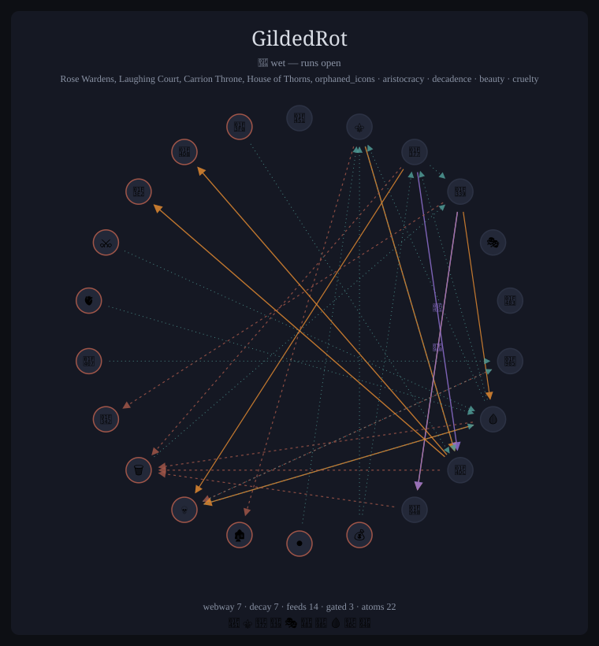
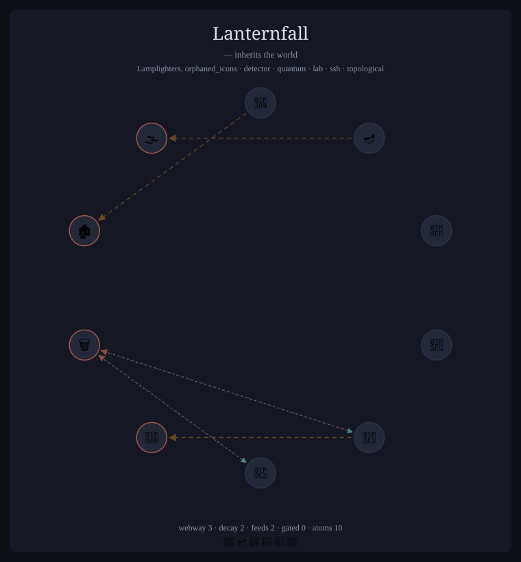

# SpaceWheat

[](https://github.com/AQuantumArchitect/SpaceWheat/actions/workflows/build-gdextension.yml)
[](LICENSE)
[](https://godotengine.org)

A quantum farming game where **the story is the physics**. Every plot is a real
qubit; every biome is a small quantum computer evolving under its own Hamiltonian;
every harvest is a projective measurement. The quantum mechanics aren't a
metaphor — they're the engine.



SpaceWheat is a game where every wheat field is a quantum register, every harvest is a projective measurement, and every season is Hamiltonian evolution. The quantum mechanics aren't a metaphor — they're the actual engine. You're playing a quantum computer that happens to look like a farm.

**The story begins in a closed quantum system** — in-fiction, *the enclave*: a world of
pure unitary evolution where nothing decays, nothing leaks, and the player's measurements
are the only irreversible acts. "Measurement IS the economy." The full dissipative
machinery (Lindblad channels, decoherence, weak measurement) is authored throughout and
wakes **per-biome**: the post-story campaign *What Fades* (`docs/OPEN_CAMPAIGN.md`)
walks the player out of the enclave into the **wet country** — 64 biomes whose authored
webways run live — and ends with the door open for good, leaving the full 164-biome
world to explore with open and closed dynamics coexisting. The island the player grew up
on stays closed forever: home is the thing the open world teaches you to miss
(`docs/CLOSED_SYSTEM.md`, `docs/inspiration/OPEN_SYSTEM_ACT2.md`).

> **Start here if you're deciding whether to care:**
> [`docs/FARMING_A_DENSITY_MATRIX.md`](docs/FARMING_A_DENSITY_MATRIX.md) —
> the ten-minute essay on what this project is and why it refuses to fake
> its physics.
>
> **Working physicist, educator, or skeptic?** [`docs/FOR_PHYSICISTS.md`](docs/FOR_PHYSICISTS.md)
> is the five-minute ledger: every concept the game teaches, what the player
> does with it, and an honesty grade per claim — exact, faithful, or
> suggestive — plus how to verify each one yourself.
>
> **Building or modding?** [`docs/GAME_CODEX.md`](docs/GAME_CODEX.md) is the
> single canonical source of truth — mental model, physics, controls, the core
> loop, the campaign — with every claim pointing at the file that is the
> authority for it.

## How It Works

This README is only a doorway. The codex is the room.

Each biome runs a **density matrix simulation** of its quantum state. A biome is a *cloud of atoms* (single emojis); its qubit axes form when a faction's **icons** are installed over it (a neighborhood) — each icon pairs two atoms into a north pole (|0>) and a south pole (|1>). A wheat qubit might be sun/moon, a population qubit might be people/fire. Pole-pairing is a neighborhood/faction product, not a property of the biome itself. The state evolves under the induced Hamiltonian — exactly, via the unitary propagator U = exp(−iH·dt), purity conserved to machine precision — and when you measure, Born's rule decides what you get. Each biome also authors a Lindblad flow-graph (its *webway*, the food web); in v0 those channels are drawn in the graph views but sealed: zero dissipators are built while the enclave holds.

- **Biome = quantum computer.** One pure-state density matrix `ρ` per biome,
  evolving under an exact closed-system unitary `U = exp(−iH·dt)` (purity stays 1).
  The open/Lindblad path exists but is **off by default** (it's DLC).
- **Icons author the Hamiltonian.** An *icon* is a two-emoji qubit axis
  (`Core/Factions/data/icons.json`). Planting icons adds qubits and their `H` terms.
- **Factions are loadouts; biomes are scaffolds.** A faction supplies a *signature*
  (a set of icons) that is *realized* into a bare biome at runtime.
- **Story fires from physics.** Narrative beats trigger when soft continuous gates
  over live observables (spectral gap, Var(H), signature growth, atom diversity,
  berry phase) cross a threshold — not from scripted dialogue.

## The core loop

1. **Strike** a qubit (Ace **R**): Born-sample it; it collapses to one emoji.
   (**F** = Explore first to open the register and see the odds; Strike costs 👥.)
2. **Gather** (Ace **Q**, costs 🧺): cash the outcome for resources — reward is the
   surprisal `−kT·log p` (rarer = richer), with a bonus if the icon is in your
   signature.
3. **Track & Incorporate** (Icon **F** then **R**): let a qubit accumulate Berry
   phase until it ripens, then incorporate its icon — your *signature* grows, and
   story beats fire.
4. Compose biomes by planting atoms; **Reap** to fast-forward evolution; trade on
   the market. Win the campaign by composing a Village whose spectral gap stays
   small — a plural island that physically cannot collapse into one shape.

### The Seven Frames

Player actions live in seven archetype frames on the number row (4–0), each a hat the
player wears:

| Key | Frame | What it does |
|-----|-------|-------------|
| **4** | **Spark** | One-shot Lindblad jolt — fires only on open (wet) ground; the dissipative kick that can re-purify. Mode 2 (🌉): Majorana bridges, never sealed. |
| **5** | **Icon** | Inject a dual-emoji qubit from the neighborhood's installed signature. |
| **6** | **Merchant** | Standing contracts with the Bath (wet ground): thermal / dephase / damp channels; export, order book, import, settle. Price = −kT·log p. |
| **7** | **Captain** | Biome lifecycle: cull, discover. |
| **8** | **Ace** | The player vantage — measurement is the verb: Gather (Q), Pause (E), Strike (R), Fast-Fwd (F). |
| **9** | **Operator** | Gate building: Bell, CNOT, CZ, SWAP, GHZ, cluster. |
| **0** | **Druid** | Unitary rotations + Hadamard (X/Y/Z axes on 1/2/3). |

Every frame speaks the same four-verb grammar (QERF — designed for touch as much as
keyboard, with **E as the universal "inspect / more information"**):
- **Q** = screw out — less, remove, retreat, harvest
- **E** = pause + inspect — read the state, collapse it, or open detail
- **R** = screw in — more, add, advance, plant
- **F** = play + flatten — close what E opened

### The Core Loop

```
STRIKE (R)  -->  GATHER (Q)  -->  FAST-FWD (F)  -->  repeat
    |                |                  |
 Born sample     surprisal payout   H respreads
 collapse state  E = −kT·log p      the odds
```

1. **Strike** samples the qubit via Born's rule and collapses it — the game's single
   irreversible act, seeded deterministically so a save-load replays the same universe.
2. **Gather** pays the *surprisal* of what you learned: improbable outcomes pay more
   because you learned more. The player is Maxwell's demon on a payroll
   (`docs/inspiration/DEMON_AT_THE_GATE.md`).
3. **Fast-forward** lets the Hamiltonian spin the odds back up. (Plant — the population
   drive — lives on the Spark hat and fires only where the ground runs open.)

Selection is a free cursor move; the strike binds the terminal it needs. Time +
Hamiltonian is the pump: after a collapse, the couplings rotate the pinned qubit back
into superposition — nothing else refills it, because nothing else needs to.

### The Story Is the Physics

The narrative layer is computed from the quantum state, not bolted on:

- **Factions carry twelve axioms** — preferences over quantum observables (purity,
  entropy, coherence, distribution, scale, dynamics). Matching them against a biome's
  live state yields the faction's **resonance** with that place, spoken as mood: *"this
  place sings to them"*, *"restless — the biome grates on their axioms"*. Press E on any
  offer to read it.
- **Quests are personality-typed.** The most resonant faction voices the physics quest,
  and its operator taste picks the ask: material factions ask you to grow a population,
  mystics to superpose, subtle ones to commit a contested pair, prismatic ones to hold
  two threads at once. Completion is soft-gated on live observables — the progress bar
  is the teacher.
- **Ten archetype voices** (with phrase banks) cover all ~99 factions — 40 authored, the
  rest derived from faction identity. The world **whispers at irreversible moments**:
  close a Berry loop and the native faction marks the incorporation; collapse an
  improbable outcome and someone witnesses the scar.
- **You are a quantum system too.** The player's identity is a density matrix over
  12-qubit faction concept-space, decaying toward the mixed state (τ = 300 s) unless
  choices keep renewing it — the one open system inside the enclave's walls. The M
  overlay reads it back: `You · Tr(ρ²) = 0.85 — resolved`.
- **A topology campaign runs through the acts.** "What Survives"
  (`docs/TOPOLOGY_CAMPAIGN.md`) teaches four genuine topological/geometric invariants
  as story arcs: Berry phase (the solid angle a loop encloses), the conserved spectrum
  (with an in-game eigenstate compass 🧭), SSH edge protection (a lantern chain whose
  bridge cannot go dark — real chiral symmetry, authored as icon data), and gate
  non-commutativity (braid words drilled by an imperial guard).
- **An open-systems campaign is the endgame.** "What Fades" (`docs/OPEN_CAMPAIGN.md`,
  acts 6–8) walks out of the enclave: dephasing as *the world going gray while nothing
  moves*, the quantum Zeno effect as *watching keeps*, literal attractors with
  hysteresis, decoherence-tested topological protection, EIT dark states as shelter
  built from interference — and the rite: a reap paid kT·ΔS from the season's entropy
  bank. Maxwell's demon stops freelancing and opens a bank.
- **A nonlocality campaign runs between them.** "What Connects"
  (`docs/CONNECT_CAMPAIGN.md`, interleaved through acts 5–7) teaches what two systems
  share that neither owns: Berry-loop **knots** (the record keeps the walks; mutual
  winding is the integer — ripeness was the shadow of a knot all along) and **Majorana
  bridges** — one fermion split between two biomes, decohering only at the *product* of
  its ends' local noise, written by braiding (an honestly Clifford alphabet), read once
  by fusion. Anchor an end on the island and the Bath can never touch it: home matters
  mechanically, forever.
- **A canonical glossary** (`Core/Documentation/glossary/`) defines the world's physics vocabulary —
  enclave, measurement, berry, webway, resonance, invariant, knot, bridge — and is
  projected live into the in-game Guide.

### Visualization

Qubits appear as floating **bubbles** on each biome's oval. Each bubble displays its two emojis with opacity proportional to measurement probability — a 70/30 superposition literally shows one emoji bright and the other dim. Entangled qubits cluster together (driven by mutual information). Quantum phase is encoded as color rotation through RGB primaries.

The inspector overlay (N key) shows the raw density matrix as a heatmap and probability bars per register. The map overlay (M → Graph) renders each biome's cluster as a live graph: purple Hamiltonian couplings, the sealed webway in dark orange, and **gold entanglement edges pulled from the live mutual-information cache** — the loom the player actually wove, glowing in proportion to bits.

### Biomes

The wet country's 64 biomes each carry a unique Hamiltonian, Lindblad configuration, and emoji palette. StarterForest has a day/night oscillation driving sun/moon populations. FungalNetworks has cross-coupled mushroom ecology. Each biome feels mechanically different because the quantum dynamics actually are different.

Navigate biomes with T-Y-U-I-O-P (6 active slots). Select plots within a biome with J-K-L-;-'-H-G.

### Economy

All resources are **emoji-credits** — unified currency per emoji type. Measurements convert quantum probability to credits at 10:1. Completing quests teaches you vocabulary icons, and known icons earn a purity bonus during seasonal reaps.

Quests are procedurally generated from faction data and reference specific emoji deliveries, pushing you to explore diverse biomes and quantum states.

## The Gallery

The project documents itself in generated artifacts — rendered from live
state or data truth, never hand-drawn:

<p align="center">
  
  
  
</p>

- **The atlas** — `python3 tools/atlas_plates.py` renders all 164 biomes as
  SVG plates straight from `biomes.json` (the file the engine boots from) in
  about a second, plus a contact sheet. A curated sixteen-plate exhibition
  ships as one self-contained page — [`docs/gallery/index.html`](docs/gallery/index.html)
  (`tools/gallery_exhibit.py`) — no external requests, hostable anywhere.
- **Postcards** — F12 in-game captures the view with the physics watermark
  rendered *into the pixels* (biome, act, Tr(ρ²), entanglement bits, phrame
  count) plus a sidecar JSON certificate in `user://postcards/`. A postcard
  and its save are a reproducible claim about a real quantum trajectory.
- **Reels** — attract mode: `SW_REEL=Core/Gallery/reels/first_light.reel.json` (or
  `godot -- --reel=…`) plays a data-driven demo through the rig's real action
  surface; any input exits to live play.
- **Recording** — Godot's movie mode turns a reel into portfolio footage:
  `SW_REEL=Core/Gallery/reels/first_light.reel.json godot --write-movie reel.avi --fixed-fps 30`,
  then ffmpeg to mp4/GIF.
- **The web door** — build → static QA → real-Chromium smoke emitting a JSON
  performance verdict: [`docs/release/WEB_DOOR.md`](docs/release/WEB_DOOR.md).

## Tech Stack

- **Engine**: Godot 4.5
- **Language**: GDScript + native C++ GDExtension
- **Quantum backend**: Custom density matrix simulator with Eigen-accelerated native path
- **Evolution**: Closed system (default) uses the exact unitary propagator U = exp(−iH·dt) — eigendecomposition in C++, Padé scaling-and-squaring in the GDScript fallback — purity-conserving to machine precision. The GKSL (Lindblad) integrator remains behind the open-system flag.
- **Gate library**: 14 gates (11 single-qubit + 3 two-qubit) with exact unitary matrices

### Native Acceleration

The `libquantummatrix` C++ extension provides:
- Dense matrix multiplication via Eigen
- Mutual information computation at physics rate (5 Hz)
- Lookahead evolution for the BiomeEvolutionBatcher

Matrix operations and gates fall back to pure GDScript when the native library
is absent (this is how the headless physics tests run), but continuous biome
evolution requires the native extension — prebuilt binaries for Linux and
Windows ship in `native/bin/`.

## Testing

164 quantum physics tests across 6 suites (142 gate tests + weak-measurement + closed-system):

| Suite | Tests | Coverage |
|-------|-------|----------|
| Exact Quantum States | 29 | Every gate against exact density-matrix elements (H, X, Y, Z, CNOT, Bell, CZ, SWAP) |
| Advanced Quantum States | 28 | Multi-gate state preparation and verification |
| Gate Application Integration | 22 | Gates applied through the real biome/register pipeline |
| 2-Qubit Gate Embedding | 63 | CNOT/CZ/SWAP embeddings across qubit orderings |
| Weak-Measurement Drain | 18 | Trace preservation, coherence decay (T₂), purity validity, η=0/1 limits |
| Closed-System Gate | 4 | Closed → zero Lindblad operators; open override rebuilds them; purity/trace ≡ 1 through evolution and projective collapse |

Run the four gate suites (142 tests):
```bash
bash 🍄/🧪/🔬.sh
```

Or run everything through the 🍄 automation lane, with per-suite selection:
```bash
bash 🍄/🧪/🔬.sh
bash 🍄/🧪/🔬.sh --suite gates
bash 🍄/🧪/🔬.sh --suite advanced
bash 🍄/🧪/🔬.sh --suite integration
bash 🍄/🧪/🔬.sh --suite embed
bash 🍄/🧪/🔬.sh --suite drain
bash 🍄/🧪/🔬.sh --suite closed
```

## Project Structure

```
Core/          Engine + game logic (~55k LOC)
  QuantumSubstrate/    QuantumComputer, HamiltonianBuilder, LindbladBuilder, gates, density matrix
  Environment/         Biome implementations, evolution batcher
  Biomes/data/         Biome registry + data (biomes.json — scaffolds + dormant L)
  Factions/data/       icons.json (H), factions.json, axes.json
  Config/Hamiltonians/ Per-biome Hamiltonian configurations (JSONL)
  Actions/             Explore / Measure / Pop / Reap verb handlers
  GameMechanics/       Farm economy, grid, terminal pool
  GameState/           Save/load, tool config, scenario builder
  Instrumentation/     Action dispatch (QuantumInstrument)
  Quests/              QuestManager, story_flags.json (the campaign), soft-gate math
  Story/               StoryEngine, socialite chatter (measurement-driven)
  Markets/             EnergyPricing (Boltzmann), MarketLattice (contracts)
  Visualization/       Bubble rendering, force graph, biome backgrounds
UI/            Thin key-in / projection-out surfaces (~26k LOC)
  Core/                QuantumInstrumentInput (input decoder), Surface, ToolConfig
  Overlays/            EscapeMenu(Z), ControlsOverlay(X), QuestBoard(C), Atlas(V)...
  HUD/                 Performance display, bot status
tests/         Physics verification suites + integration tests
native/        C++ GDExtension (libquantummatrix) — Eigen-accelerated backend
docs/          Documentation — start at GAME_CODEX.md
🍄/            Automation lane (headless runners, rig, test harnesses, batch tools)
```

## Building

Requires Godot 4.5. Open the project in the WSL-aware editor launcher, or run headless:

```bash
./scripts/launch_game.sh         # play (Linux, headed)
./scripts/editor_launch.sh       # open in the Godot editor
python3 -m pytest tests/ -q      # Python test suite (rig-driven + source contracts)
```
- Native C++ extension: `cd native && scons` (see **[`BUILDING.md`](BUILDING.md)**).
- Headless automation / LLM lane: `🍄/🎛️/🟢.sh` (docs in `🍄/README.txt`).
- Boot-error gate (must print `0`):
  `godot --headless --audio-driver Dummy --path . --quit 2>&1 | grep -cE "SCRIPT ERROR|Parse Error|ERROR: Failed to"`

Known open issues, design questions, and tech debt are tracked honestly in
[`docs/KNOWN_ISSUES.md`](docs/KNOWN_ISSUES.md) rather than left buried in
internal audit docs.

## How this was built

A meaningful share of this codebase, including the `🍄/` automation lane and
much of the release/test tooling, was built through direct collaboration
with AI coding agents driving the real game headlessly. See
[`docs/DEVELOPMENT.md`](docs/DEVELOPMENT.md) for how that actually works —
the same headless rig that development used is also how the physics test
suite and CI verify every change.

## License

MIT — see [`LICENSE`](LICENSE).

Bundled third-party assets carry their own terms; Twemoji in particular is
CC-BY 4.0 and its attribution is owed. See
[`THIRD_PARTY_NOTICES.md`](THIRD_PARTY_NOTICES.md), which ships inside every
release archive.
